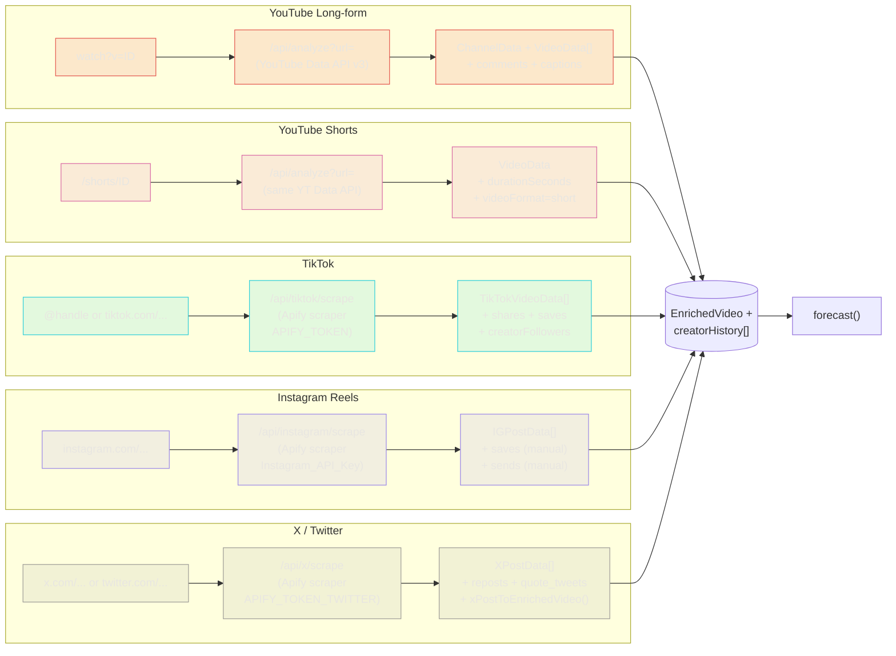
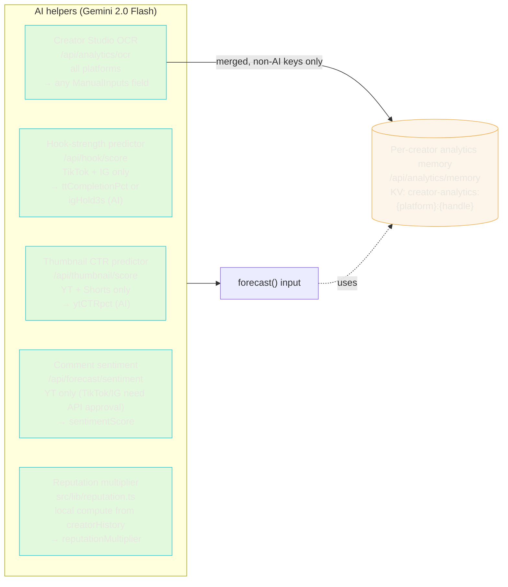
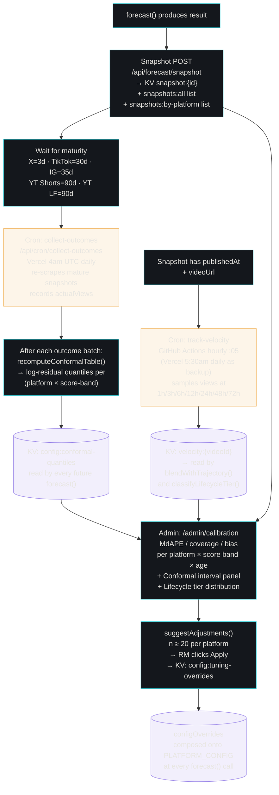
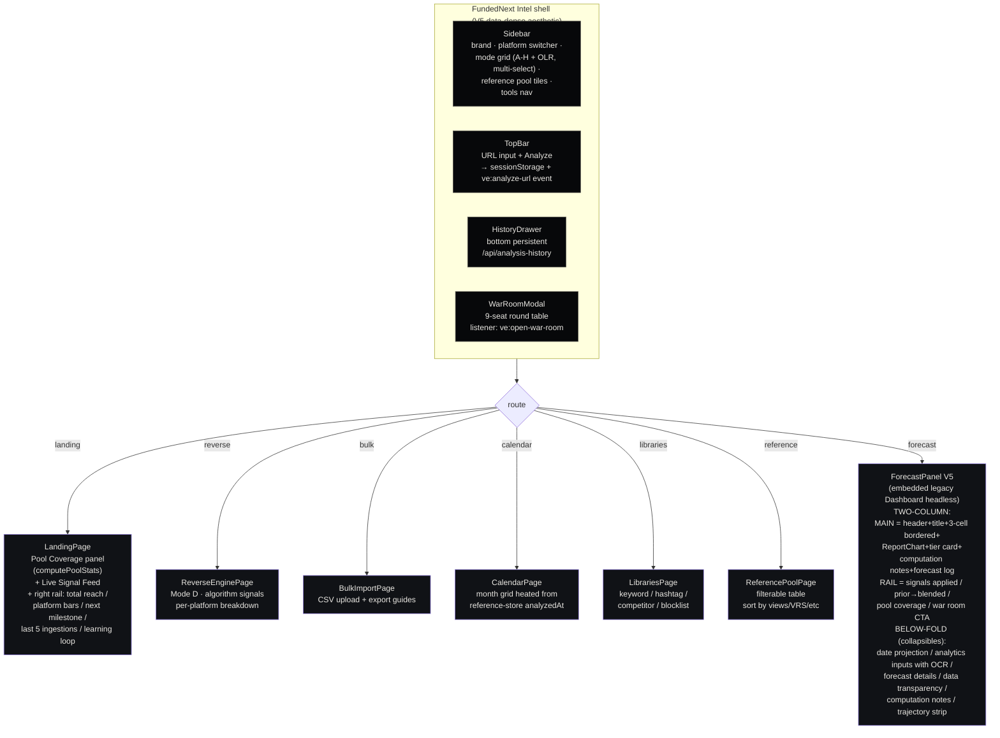

# Virality Engine — End-to-End Flow

A complete trace of what happens between an RM pasting a URL and a forecast rendering on screen, across all 5 supported platforms and all content types.

**Supported platforms:** YouTube Long-form (YTL), YouTube Shorts (YTS), TikTok (TTK), Instagram Reels (IGR), X/Twitter (X).
**LinkedIn is not supported** and was purged 2026-04-20 — do not re-add.

---

## 1 · High-level flow (one-pager)

```mermaid
flowchart TD
  subgraph Entry["ENTRY POINTS"]
    A1["TopBar URL paste<br/>(new shell)"]
    A2["Legacy Dashboard<br/>per-platform URL inputs"]
    A3["Bulk CSV upload<br/>/api/bulk-import"]
    A4["Direct reference-store<br/>POST /api/reference-store"]
  end

  Entry --> B["URL PARSER<br/>src/lib/url-parser.ts"]

  B -->|youtube.com/watch| YT[YouTube Long-form]
  B -->|youtube.com/shorts| YS[YouTube Shorts]
  B -->|tiktok.com| TT[TikTok]
  B -->|instagram.com| IG[Instagram Reels]
  B -->|x.com / twitter.com| X[X / Twitter]

  YT --> FETCH{Platform fetch}
  YS --> FETCH
  TT --> FETCH
  IG --> FETCH
  X  --> FETCH

  FETCH --> ENRICH["ENRICHMENT<br/>enrichVideo()<br/>score · duration · format<br/>language · velocity · outlier"]

  ENRICH --> WRITE[Write to reference store + keyword bank]
  ENRICH --> FCE["FORECAST ENGINE<br/>src/lib/forecast.ts"]

  WRITE -->|poolWrite() fires| EV["ve:pool-updated event"]
  EV --> UI["Sidebar + Landing<br/>refresh live"]

  FCE --> RENDER["ForecastPanel V5<br/>two-column render"]

  classDef entry fill:#0B0C0E,stroke:#E4574E,color:#E8E6E1
  classDef plat fill:#101216,stroke:#2ECFD9,color:#E8E6E1
  classDef proc fill:#14171C,stroke:#9B87E8,color:#E8E6E1
  class A1,A2,A3,A4 entry
  class YT,YS,TT,IG,X plat
  class B,FETCH,ENRICH,WRITE,FCE,RENDER,EV,UI proc
```

---

## 2 · Platform-specific fetch paths

Each platform has its own scraper / API because the data sources differ substantially.



### Env vars per platform

| Platform | Required env var | Fallback | Source |
|---|---|---|---|
| YouTube (all) | `YOUTUBE_API_KEY` | `YOUTUBE_API_KEY_2` | Google Cloud YouTube Data API v3 |
| TikTok | `APIFY_TOKEN` | `TikTok_API_Key` | Apify TikTok scraper |
| Instagram | `APIFY_TOKEN` | `Instagram_API_Key` | Apify Instagram scraper |
| X | `APIFY_TOKEN_TWITTER` | `APIFY_TOKEN` | Apify Twitter scraper |
| AI (all) | `GEMINI_API_KEY` | `GEMINI_API_KEY_2` | Google Gemini Vision (thumbnail/hook/OCR/sentiment) |
| Anthropic | `Claude_AI_Summary_API_KEY` | `ANTHROPIC_API_KEY` | Claude (War Room experts) |
| Market sig | `GNEWS_API` | `GNEWS_API_KEY` | GNews (market volatility proxy) |
| KV | `KV_REST_API_URL` + `KV_REST_API_TOKEN` | — | Upstash Redis (forecast snapshots, conformal table, tier stats, creator memory) |
| Cron auth | `CRON_SECRET` | — | Required for both Vercel cron and GitHub Actions hourly workflow |

---

## 3 · Forecast engine internals

This is `src/lib/forecast.ts::forecast()` — every platform goes through the same pipeline.

```mermaid
flowchart TD
  INPUT["ForecastInput<br/>{video, creatorHistory, platform,<br/>manualInputs, velocitySamples,<br/>sentimentScore, nicheMultiplier,<br/>reputationMultiplier,<br/>configOverrides, conformalTable,<br/>aiEstimatedKeys}"]

  INPUT --> S1["Step 1 · Creator baseline<br/>median / p25 / p75 / CV<br/>from creatorHistory[]"]
  S1 -->|< minBaselinePosts| SC["SHORT-CIRCUIT<br/>insufficient history<br/>→ ask for manual baseline"]
  S1 -->|sufficient| S2

  S2["Step 2 · Score multiplier<br/>VRS/TRS/IRS/XRS/YRS → 0-100<br/>scoreToMultiplier() → power curve<br/>platform-tuned scoreExponent"]

  S2 --> S3["Step 3 · Manual input adjustments<br/>applyManualAdjustments()<br/>TT completion% / IG sends/saves<br/>YT AVD%/CTR% / X TweepCred<br/>tighten uncertainty bounds"]

  S3 --> S4["Step 4 · Record data sources<br/>dataUsed / dataEstimated / dataMissing<br/>AI estimates routed to dataEstimated"]

  S4 --> S5["Step 5 · Build prior (lifetime)<br/>baseline × score × seasonality<br/>× niche × reputation × sentimentUpside"]

  S5 --> S6["Step 6 · Bayesian trajectory blend<br/>blendWithTrajectory()<br/>prior × (1-w) + trajectory × w<br/>w scales with cumulativeShare(age)<br/>velocity acceleration adjusts trajectory"]

  S6 --> S6b["Step 6b · Conformal intervals<br/>applyConformalBounds()<br/>replaces hand-tuned low/high bands<br/>with empirical residual quantiles<br/>per (platform × score-band)<br/>fallback: hand-tuned if <20 samples"]

  S6b --> S6c["Step 6c · Lifecycle-tier clamp<br/>classifyLifecycleTier()<br/>TikTok / IG / Shorts only<br/>clamps lifetime.high DOWN when tier<br/>is stuck (tier-1, tier-2) or plateau"]

  S6c --> S7["Step 7 · Project milestones<br/>d1 / d7 / d30 via<br/>lifetime × cumulativeShare(day)<br/>lerpShare interpolates between knots"]

  S7 --> S8["Step 8 · Confidence scoring<br/>history depth + consistency<br/>+ real manual inputs<br/>(AI estimates excluded)<br/>+ trajectory blend weight"]

  S8 --> S9["Step 9 · Interpretation<br/>RM-friendly plain English<br/>based on trajectory verdict"]

  S9 --> OUT["Forecast output<br/>{lifetime, d1, d7, d30,<br/>scoreMultiplier, baseline,<br/>confidence, trajectory,<br/>lifecycleTier, dataUsed,<br/>dataEstimated, dataMissing,<br/>interpretation, notes}"]

  classDef step fill:#14171C,stroke:#9B87E8,color:#E8E6E1
  classDef term fill:#0B0C0E,stroke:#2ECC8A,color:#E8E6E1
  classDef warn fill:#E457F222,stroke:#E457F2,color:#E8E6E1
  class S1,S2,S3,S4,S5,S6,S6b,S6c,S7,S8,S9 step
  class INPUT,OUT term
  class SC warn
```



### Per-platform variations inside `forecast()`

Controlled by `PLATFORM_CONFIG[platform]` in `forecast.ts`:

| Platform | Horizon | Curve shape | Upside multiplier | Downside | Score exponent | Min baseline posts | Tier classifier? |
|---|---|---|---|---|---|---|---|
| YouTube LF | 365d | evergreen (slow build, long tail) | 8× | 0.15 | 2.0 | 5 | **no** (age-aware label instead) |
| YouTube Shorts | 90d | two-phase (initial burn + extension) | 15× | 0.10 | 2.3 | 8 | **yes** |
| TikTok | 30d | aggressive early decay (70% gate) | 20× | 0.08 | 2.5 | 10 | **yes** |
| Instagram Reels | 35d | audition + save-extended tail | 12× | 0.10 | 2.2 | 8 | **yes** |
| X (Twitter) | 3d | 6h half-life | 25× | 0.05 | 2.8 | 15 | **no** (pure time-decay) |

---

## 4 · Side-channel AI helpers (feed `forecast()`)

All optional. When an RM doesn't have Creator Studio data, these fill the gap via Gemini Vision / Gemini text.



**AI-estimate discipline:** every field auto-filled by an AI helper is flagged in `aiEstimatedKeys`. The forecast() confidence-scoring step excludes AI keys from the "private analytics provided" bump. The per-creator memory save also filters them out so AI estimates never pollute persisted real data.

---

## 5 · Learning loop

Closes the prediction → outcome feedback loop so the engine gets more accurate over time.



---

## 6 · UI layer — how the forecast renders



---

## 7 · Data stores

| Store | Purpose | Key format | Writer | Reader |
|---|---|---|---|---|
| `src/data/reference-store.json` | Pool of analyzed videos + creators | `.entries[]` array | legacy Dashboard analyze flow, bulk-import | everything (pool coverage, landing, forecast baseline) |
| `src/data/keyword-bank.json` | Niche / competitor / content-type / language keywords | `.categories.{niche,competitors,contentType,language}` | `expandKeywordBank()` from every analyze | keyword-driven UI panels |
| KV `snapshot:{id}` | Individual forecast snapshots | prefixed | `recordForecast()` on every analyze | cron/collect-outcomes, calibration, conformal |
| KV `snapshots:all` list | All snapshot IDs | Redis list | snapshot POST | calibration, tier-stats |
| KV `snapshots:by-platform:{p}` | Platform-scoped snapshot IDs | Redis list | snapshot POST | calibration per-platform |
| KV `snapshots:by-video:{videoId}` | Per-video snapshot history | Redis list | snapshot POST | track-velocity |
| KV `velocity:{videoId}` | Time-series view samples | Redis list | `/api/cron/track-velocity` | forecast, lifecycle-tier |
| KV `config:conformal-quantiles` | Residual quantile table | JSON | collect-outcomes auto-recompute, admin | every forecast |
| KV `config:tuning-overrides` | RM-applied platform config patches | JSON | admin "Apply" | every forecast |
| KV `creator-analytics:{platform}:{handle}` | Per-creator manual inputs | JSON | ForecastPanel memory save | ForecastPanel memory load |
| KV `thumbnail-ctr:{sha1(url)}` | Thumbnail CTR cache | JSON | `/api/thumbnail/score` | `/api/thumbnail/score` |
| KV `hook-strength:{sha1(url\|caption\|platform)}` | Hook score cache | JSON | `/api/hook/score` | `/api/hook/score` |

---

## 8 · Content-type matrix

The five platforms × the forecast engine pathway.

| Signal / feature | YTL | YTS | TTK | IGR | X |
|---|---|---|---|---|---|
| Fetch endpoint | `/api/analyze` | `/api/analyze` | `/api/tiktok/scrape` | `/api/instagram/scrape` | `/api/x/scrape` |
| VRS variant | YRS (long-form) | YRS (shorts band) | TRS | IRS | XRS |
| Horizon | 365d | 90d | 30d | 35d | 3d |
| Tier classifier | N/A (age-aware label) | ✓ | ✓ | ✓ | N/A (time-decay) |
| Thumbnail-CTR predictor | ✓ | ✓ | — | — | — |
| Hook-strength predictor | — | — | ✓ | ✓ | — |
| Comment sentiment (auto) | ✓ | ✓ | ❌ (needs Research API) | ❌ (needs Graph API) | ❌ |
| Private analytics fields | ytAVDpct, ytCTRpct, ytImpressions | ytAVDpct, ytCTRpct | ttCompletionPct, ttRewatchPct, ttFypViewPct | igSaves, igSends, igReach, igHold3s | xTweepCred, xReplyByAuthor |
| OCR screenshot support | ✓ | ✓ | ✓ | ✓ | ✓ |
| Conformal intervals | ✓ (once ≥20 matured) | ✓ | ✓ | ✓ | ✓ |
| Maturity window (outcome collection) | 90d | 90d | 30d | 35d | 3d |
| Velocity samples | 6h/24h/72h/7d/14d/30d | 2h/6h/12h/24h/48h/168h/336h | 1h/3h/6h/12h/24h/48h/72h/168h | 1h/3h/6h/12h/24h/48h/72h/168h | 1h/3h/6h/12h/24h/48h/72h |

---

## 9 · Event bus (window-level)

Loose-coupled signals between the new shell and legacy Dashboard.

| Event name | Fired by | Listened by | Purpose |
|---|---|---|---|
| `ve:analyze-url` | NewDashboard.handleAnalyze (TopBar click) | Dashboard headless-mode listener | Hot re-trigger analyze when Dashboard is already mounted |
| `ve:pool-updated` | Dashboard `poolWrite()` (after any reference-store or keyword-bank POST) | NewDashboard sidebar + LandingPage | Refresh pool stats live without reload |
| `ve:open-war-room` | ForecastPanel rail CTA | NewDashboard | Show the War Room modal |

---

## 10 · Cron + scheduling

| Schedule | Endpoint | Purpose | Runner |
|---|---|---|---|
| Hourly :05 | `/api/cron/track-velocity` | Sample view counts at 1h/3h/6h/12h/24h/48h/72h milestones for TikTok/IG/X/Shorts. | GitHub Actions workflow (`.github/workflows/track-velocity.yml`) — Vercel Hobby caps at 1 cron/day so GH does the sub-daily cadence |
| 5:30am UTC daily | `/api/cron/track-velocity` | Backup velocity sampling for days where GH Actions missed. | Vercel Cron |
| 4am UTC daily | `/api/cron/collect-outcomes` | Re-scrape mature videos, record `actualViews` against stored snapshots, recompute conformal table. | Vercel Cron |

Both cron endpoints require `Authorization: Bearer $CRON_SECRET`. The same value must be set as both a Vercel env var AND a GitHub Actions repository secret for the hourly workflow to authenticate.
